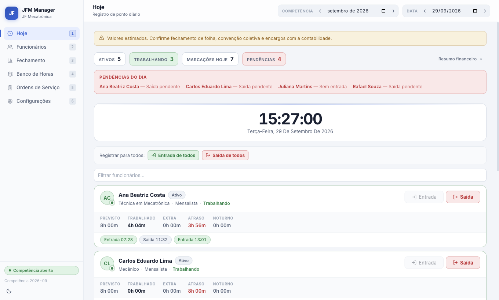
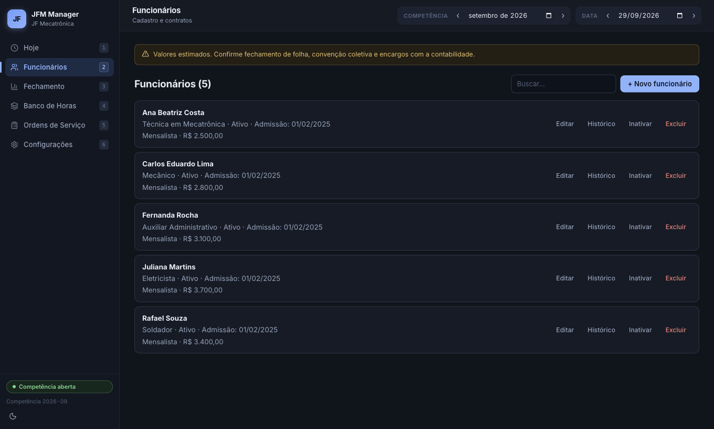

# JFM Manager


Aplicativo desktop de controle de ponto e folha de pagamento, criado para a JF Mecatrônica. Registra as marcações do dia, calcula jornada, horas extras, adicional noturno e banco de horas pelas regras da CLT, e fecha a competência com espelho, holerites e arquivo do eSocial.



<details>
<summary>Tema escuro · cadastro de funcionários</summary>



</details>

> Os dados das imagens são fictícios.

---

## Funcionalidades

- **Ponto do dia:** entrada e saída por funcionário ou para todos de uma vez, com desfazer, relógio ao vivo e lista de pendências
- **Cálculo de jornada (CLT):** horas previstas, trabalhadas, extras, atrasos e adicional noturno
- **Banco de horas:** lançamentos, compensações e saldo por funcionário
- **Fechamento mensal:** espelho de ponto, relatório por funcionário, holerites em PDF e geração do evento S-1200 do eSocial
- **Competência fechada é imutável:** depois de fechar o mês, ponto e feriados não podem mais ser alterados
- **Auditoria:** histórico de todas as alterações
- **Ordens de serviço**, feriados, regras de folha e backup automático diário do banco (opcional)

## Decisões técnicas

- **Processo principal isolado:** a interface só fala com o banco por IPC (`window.jfm.*` exposto pelo `preload.js`), sem acesso direto ao Node
- **Validação em duas camadas:** formulários validados com Zod no React e regras de negócio validadas de novo nos handlers IPC
- **Integridade no banco:** SQLite com chaves estrangeiras ativas e regras de fechamento aplicadas no processo principal
- **Design system próprio:** CSS em camadas (tokens → base → layout → componentes) com tema claro e escuro via `light-dark()`

## Tecnologias

Electron · React 19 · TypeScript · Vite · SQLite (better-sqlite3) · react-hook-form + Zod · Vitest · sonner · lucide-react

---

## Como executar

```bash
git clone https://github.com/luuhkas/jfm-manager.git
cd jfm-manager
npm install
npm --prefix renderer install
npm run dev
```

## Testes

```bash
npm test
```

São 13 testes: 6 dos cálculos de jornada no renderer (Vitest) e 7 dos handlers IPC do processo principal, rodando contra um SQLite em memória.

> Se o teste do processo principal reclamar de `NODE_MODULE_VERSION`, recompile o módulo nativo para o Electron: `npx @electron/rebuild -f -w better-sqlite3`.

## Estrutura

```
jfm-manager/
├── src/main/                  # Processo principal (Electron)
│   ├── main.js                # Janela, ciclo de vida, backup automático
│   ├── preload.js             # Ponte segura (window.jfm.*)
│   ├── db.js                  # Schema e inicialização do SQLite
│   └── ipc/                   # Handlers por domínio: employees, ponto, holidays,
│                              # hourBank, monthClosings, esocial, pdf, audit...
├── renderer/                  # Interface (Vite + React + TypeScript)
│   └── src/
│       ├── styles/            # tokens.css, base.css, layout.css, components.css
│       └── modules/ponto/
│           ├── PontoPage.tsx          # Orquestra as abas
│           ├── usePontoPageState.ts   # Estado e chamadas IPC
│           ├── laborRules.ts          # Regras da CLT
│           ├── pontoUtils.ts          # Cálculos de jornada e folha
│           ├── forms.ts               # Schemas Zod dos formulários
│           ├── __tests__/             # Testes do renderer
│           └── components/            # Uma aba por arquivo
├── tests/                     # Testes do processo principal (IPC)
└── docs/screenshots/
```

---

## Autor

**Lucas Maués**, estudante de Ciência da Computação na UTFPR

## Licença

MIT
